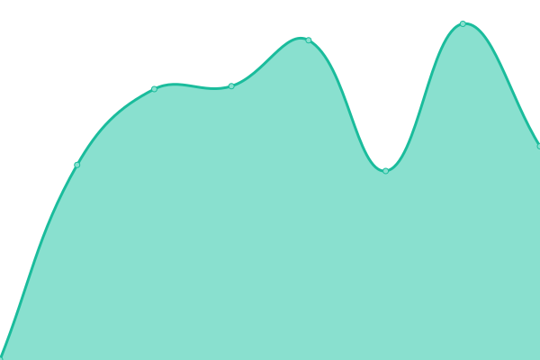

# [📈 Live Status](https://wtznc.github.io/up): <!--live status--> **🟩 All systems operational**

This repository contains the open-source uptime monitor and status page for [Wojciech Tyziniec](https://wtznc.github.io/up), powered by [Upptime](https://github.com/upptime/upptime).

With [Upptime](https://upptime.js.org), you can get your own unlimited and free uptime monitor and status page, powered entirely by a GitHub repository. We use [Issues](https://github.com/wtznc/up/issues) as incident reports, [Actions](https://github.com/wtznc/up/actions) as uptime monitors, and [Pages](https://wtznc.github.io/up) for the status page.

<!--start: status pages-->
<!-- This summary is generated by Upptime (https://github.com/upptime/upptime) -->
<!-- Do not edit this manually, your changes will be overwritten -->
<!-- prettier-ignore -->
| URL | Status | History | Response Time | Uptime |
| --- | ------ | ------- | ------------- | ------ |
|  Lifestack Landing | 🟩 Up | [lifestack-landing.yml](https://github.com/wtznc/up/commits/HEAD/history/lifestack-landing.yml) | 

 920ms
     
 | 

<a href="https://dash.tyziniec.com/history/lifestack-landing">100.00%</a>
    

|  Lifestack App | 🟩 Up | [lifestack-app.yml](https://github.com/wtznc/up/commits/HEAD/history/lifestack-app.yml) | 

 1680ms
     
 | 

<a href="https://dash.tyziniec.com/history/lifestack-app">100.00%</a>
    

|  Pi-hole | 🟩 Up | [pi-hole.yml](https://github.com/wtznc/up/commits/HEAD/history/pi-hole.yml) | 

 2061ms
     
 | 

<a href="https://dash.tyziniec.com/history/pi-hole">100.00%</a>
    

|  Tyziniec.com | 🟩 Up | [tyziniec-com.yml](https://github.com/wtznc/up/commits/HEAD/history/tyziniec-com.yml) | 

 308ms
     
 | 

<a href="https://dash.tyziniec.com/history/tyziniec-com">100.00%</a>
    

|  Uptime | 🟩 Up | [uptime.yml](https://github.com/wtznc/up/commits/HEAD/history/uptime.yml) | 

 297ms
     
 | 

<a href="https://dash.tyziniec.com/history/uptime">100.00%</a>
    

<!--end: status pages-->

[**Visit our status website →**](https://wtznc.github.io/up)

## 📄 License

- Powered by: [Upptime](https://github.com/upptime/upptime)
- Code: [MIT](./LICENSE) © [Anand Chowdhary](https://anandchowdhary.com), supported by [Pabio](https://pabio.com)
- Data in the `./history` directory: [Open Database License](https://opendatacommons.org/licenses/odbl/1-0/)
